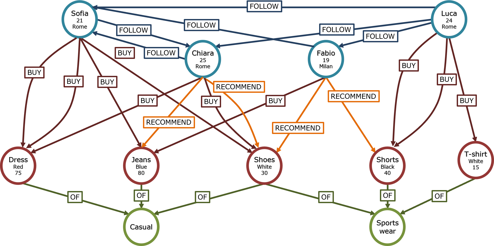

# Mine Graph Rule
[](https://github.com/FrInve/mine_graph_rule/actions/workflows/maven.yml)

A Graph Association Rule Mining Procedure for Neo4j.

##  Overview

This APOC procedure was developed as a complementary tool to the syntax operator introduced in our article (https://doi.org/10.48550/arXiv.2406.19106). For a deeper explanation of the underlying concepts and motivations, we encourage you to refer to the publication.

The goal of this procedure is to empower users to define and extract arbitrary sets of graph association rules directly from their Neo4j graph data. It is designed to support a wide range of graph traversal patterns and flexible rule definitions. While still a work in progress, the procedure already covers many core functionalities, and we are actively working to expand its capabilities.

If you have questions, feedback, or suggestions, feel free to reach out—we'd be happy to hear from you!

## Developed By

The MineGraphRule procedure was primarily developed by Francesco Invernici and Francesco Cambria, under the supervision of Anna Bernasconi and Stefano Ceri, at the Department of Electronics, Information and Bioengineering (DEIB), Politecnico di Milano.

To stay updated on our work and the broader research activities of our group, feel free to follow us on [LinkedIn](https://www.linkedin.com/in/data-science-group-9713b0327/).

## Installation

## Version 1.1

```cypher
CALL apoc.mgr.mineGraphRule(anchorVariable,
                            anchorLabel,
                            anchorWhere,
                            headItemset,
                            bodyItemset,
                            whereConditions,
                            ignoredVariables,
                            minSupport,
                            minConfidence)
```
### Parameters

+ `anchorVariable` \<String\> : Used for both path construction in both body and head and in conditions on the anchor
+ `anchorLabel` \<String\> : To select which nodes are the anchors of the Graph Association Rules
+ `anchorWhere` \<String\> : Predicate for filtering anchor nodes based on properties
+ `headItemset` \<List\> : List of Patterns used for building the itemset of the Head
+ `bodyItemset` \<List\> : List of Patterns used for building the itemset of the Body
+ `whereConditions` \<List\> : List of Conditions on body and head Patterns
+ `ignoredVariables` \<List\> : List of variables to Ignore when constructing Rules
+ `minSupport` \<Float\>: Threshold value for filtering based on Support
+ `minConfidence` \<Float\>: Threshold value for filtering based on Confidence

### Example

To better understand how the Mine Graph Rule operator works we can refer to the following simple instance of a property graph:



We have three different nodes Labels: 
+ Person nodes that can FOLLOW each other.
+ Item nodes representing things that Persons can either BUY or RECOMMED.
+ Category nodes to group items under shared themes or types.

All the following examples of the operator will refer to this graph.

#### Simple Association Rules

The simplest and most classical set of the Association rules studies customer behavior by looking for which items are bought together. In Mine Graph Rule this can be done with:

```cypher
CALL apoc.mgr.mineGraphRule("person",
                            "Person",
                            "",
                            [{numMin:1, numMax:1, patternTail:[{type: "normal", relationshipType: "BUY", nodeLabel: "Item", nodeVariable:"h"}]}],
                            [{numMin:1, numMax:1, patternTail:[{type: "normal", relationshipType: "BUY", nodeLabel: "Item", nodeVariable:"b"}]}], 
                            [], 
                            [], 
                            0.1, 
                            0.1); 
```

Special considerations: 

+ `anchorVariable`: "person" 
+ `anchorLabel`: "Person", so the body and head patterns will start with nodes of this label
+ `headItemset`: Pattern of lenght 1 of type "normal" (with no special condition on the relationship, simply the specification of the relationship type) with relationship of type BUY, resulting in a head itemset made of a single pattern shaped as `(:Person)-\[:BUY\]->(:Item)`
+ `bodyItemset` : Mirroring the head itemset, the body itemset are made of a single pattern shaped as `(:Person)-\[:BUY\]->(:Item)`
+ `minSupport`: Support Threshold at 0.1
+ `minConfidence`: Confidence Threshold at 0.1

A resulting example of an extracted rule is: "People who buy Dress also buy Shoes".

#### Simple Association Rules filter on the Anchor

To specify a more limited set of Anchor nodes we can use the anchorWhere variable, for example to look for only rules based on people living in Rome:

```cypher
CALL apoc.mgr.mineGraphRule("person",
                            "Person",
                            "person.city = 'Rome'",
                            [{numMin:1, numMax:1, patternTail:[{type: "normal", relationshipType: "BUY", nodeLabel: "Item", nodeVariable:"h"}]}],
                            [{numMin:1, numMax:1, patternTail:[{type: "normal", relationshipType: "BUY", nodeLabel: "Item", nodeVariable:"b"}]}], 
                            [], 
                            [], 
                            0.1, 
                            0.1); 
```

Special considerations:

+ `anchorWhere`: "person.city = 'Rome'" uses the condition directly as it would have been written in Cypher to specify the filter on the anchor nodes

A resulting example of an extracted rule is: "People, living in Rome, who buy Dress also buy Shirt".

#### Association Rules with multiple items

To look for Association Rules with bigger itemsets we can either use the numMax variable in the headItemset or bodyItemset:

```cypher
CALL apoc.mgr.mineGraphRule("person",
                            "Person",
                            "",
                            [{numMin:1, numMax:2, patternTail:[{type: "normal", relationshipType: "BUY", nodeLabel: "Item", nodeVariable:"h"}]}],
                            [{numMin:1, numMax:3, patternTail:[{type: "normal", relationshipType: "BUY", nodeLabel: "Item", nodeVariable:"b"}]}], 
                            [], 
                            [], 
                            0.1, 
                            0.1); 
```

Special considerations:

+ `headItemset` & `bodyItemset`: numMax equal to 2 and 3 meaning that the rules will look for association of itemsets made of up to 2 and 3 items.


A resulting example of an extracted rule is: "People who buy Dress, Shoes, and Glasses also buy Shirt and Hat".

Otherwise, the operator allows to create Association rules with bigger itemsets made of different patterns structures.

```cypher
CALL apoc.mgr.mineGraphRule("person",
                            "Person",
                            "",
                            [{numMin:1, numMax:1, patternTail:[{type: "normal", relationshipType: "BUY", nodeLabel: "Item", nodeVariable:"h"}]}],
                            [{numMin:1, numMax:1, patternTail:[{type: "normal", relationshipType: "BUY", nodeLabel: "Item", nodeVariable:"b1"}]}, {numMin:1, numMax:1, patternTail:[{type: "normal", relationshipType: "FOLLOW", nodeLabel: "Person", nodeVariable:"b2"}]}], 
                            [], 
                            [], 
                            0.1, 
                            0.1); 
```

Special considerations:

+ `bodyItemset`: the itemset is made of two different patterns (both starting from the anchor) one looking for a bought item ((:Person)-\[:BUY\]->(:Item)) and one looking for a followed person ((:Person)-\[:FOLLOW\]->(:Person))

A resulting example of an extracted rule is: "People who buy Dress and follow Chiara also buy Shirt".

#### Association Rules with longer patterns

Mine Graph Rule allows also to look for Association Rules with longer patterns. For example to have patterns considering also item's categories:


```cypher
CALL apoc.mgr.mineGraphRule("person",
                            "Person",
                            "",
                            [{numMin:1, numMax:1, patternTail:[{type: "normal", relationshipType: "BUY", nodeLabel: "Item", nodeVariable:"h"}, {type: "normal", relationshipType: "OF", nodeLabel: "Category", nodeVariable:"ch"}]}],
                            [{numMin:1, numMax:1, patternTail:[{type: "normal", relationshipType: "BUY", nodeLabel: "Item", nodeVariable:"b"}, {type: "normal", relationshipType: "OF", nodeLabel: "Category", nodeVariable:"cb"}]}], 
                            [], 
                            [], 
                            0.1, 
                            0.1); 
```

Special considerations:

+ `headItemset` & `bodyItemset`: patterTail List has another element (of type "normal", so a single relationship of type OF) making the resulting patterns as `(:Person)-\[:BUY\]->(:Item)-\[:OF\]->(:Category)`

A resulting example of an extracted rule is: "People who buy Dress of category Sportive also buy Shoes of category Casual".

To look for association rules starting from (:Person) but with a focus only on the categories, Mine Graph Rule exploits its Ignore Feature:

```cypher
CALL apoc.mgr.mineGraphRule("person",
                            "Person",
                            "",
                            [{numMin:1, numMax:1, patternTail:[{type: "normal", relationshipType: "BUY", nodeLabel: "Item", nodeVariable:"h"}, {type: "normal", relationshipType: "OF", nodeLabel: "Category", nodeVariable:"ch"}]}],
                            [{numMin:1, numMax:1, patternTail:[{type: "normal", relationshipType: "BUY", nodeLabel: "Item", nodeVariable:"b"}, {type: "normal", relationshipType: "OF", nodeLabel: "Category", nodeVariable:"cb"}]}], 
                            [], 
                            ["h","b"], 
                            0.1, 
                            0.1); 
```

+ `ignoredVariables`: Specifizes that variables "h" and "b" should not be instanced when looking for the association rules

A resulting example of an extracted rule is: "People who buy items of category Sportive also buy items of category Casual".

#### Association Rules with AnyRel

Another type of condition on the relationship in the building of patterns is AnyRel:

```cypher
CALL apoc.mgr.mineGraphRule("person",
                            "Person",
                            "",
                            [{numMin:1, numMax:1, patternTail:[{type: "normal", relationshipType: "BUY", nodeLabel: "Item", nodeVariable:"h"}]}],
                            [{numMin:1, numMax:1, patternTail:[{type: "any", relationshipType: "ANY", nodeLabel: "Item", nodeVariable:"b", relationshipLength: "1"}]}], 
                            [], 
                            [], 
                            0.1, 
                            0.1); 
```

Special considerations:

+ `bodyItemset`: Pattern of type "any" (where allows for the opportunity of navigating any possible relationship type and in this example resulting in possibly going through either BUY or RECOMMEND) of lenght 1, resulting in a body itemset made of a single pattern shaped as `(:Person)-[]->(:Item)`. (Thanks to relationshipLenght the path can have nay chosen maximum lenght)

A resulting example of an extracted rule is: "People who are connected to Dress also buy Shirt".

#### Association Rules with CountRel

Another type of condition on the relationship in the building of patterns is CountRel, to specify the number of relationships between different nodes:

```cypher
CALL apoc.mgr.mineGraphRule("person",
                            "Person",
                            "",
                            [{numMin:1, numMax:1, patternTail:[{type: "normal", relationshipType: "BUY", nodeLabel: "Item", nodeVariable:"h"}]}],
                            [{numMin:1, numMax:1, patternTail:[{type: "count", relationshipType: "BUY", nodeLabel: "Item", nodeVariable:"b", minValue:"2"}]}],
                            [], 
                            [], 
                            0.1, 
                            0.1); 
```

Special considerations:

+ `bodyItemset`: Pattern of type `count` (where sets a condition on the number (at least 2) of relationships BUY between (:Person) and (:Item)) of lenght 1.

A resulting example of an extracted rule is: "People who buy at least 2 times Shirt also buy Shoes".

#### Association Rules with conditions on the patterns

Mine Graph Rule allows also to set specific conditions on the nodes in both the body and head patterns:

```cypher
CALL apoc.mgr.mineGraphRule("person",
                            "Person",
                            "",
                            [{numMin:1, numMax:1, patternTail:[{type: "normal", relationshipType: "BUY", nodeLabel: "Item", nodeVariable:"h"}]}], 
                            [{numMin:1, numMax:n, patternTail:[{type: "normal", relationshipType: "BUY", nodeLabel: "Item", nodeVariable:"b"}]}], 
                            [{variable:"h", variableProperty:"price", operand:">", constantValue: "40"}, {variable:"b", variableProperty:"price", operand:"<", otherVariable: "h", otherVariableProperty: "price"}],
                            [],
                            0.1,
                            0.1);
```

Special considerations:

+ `whereConditions` (1): we first set a condition based on a node property and comparing it to a constant value. The price of the node with variable "h" (node (:Item) in the head itemset) needs higher than 40
+ `whereConditions` (2): we also set a condition comparing node properties of different node patterns. The price of the node with variable "b" (node (:Item) in the body itemset) need to be lower than the price of the node with variable "h" (node (:Item) in the head itemset)

A resulting example of an extracted rule is: "People who buy Shoes (price 30) also buy T-Shirt (price 15)".

## Version 1.2

```cypher
CALL apoc.mgr.mineGraphRule(anchorVariable,
                            anchorLabel,
                            anchorWhere,
                            headItemset,
                            bodyItemset,
                            whereConditions,
                            ignoredVariables,
                            minSupport,
                            minConfidence,
                            outputProperties)
```
### Changes

+ Added `outputProperties` \<Map \<String\>\>: To specify which property for each node Label show in the output
+ Added `patternAlias` field within `headItemset` and `bodyItemset` to rename the output columns as desired by the user

### Example 

```cypher
CALL apoc.mgr.mineGraphRule("person",
                            "Person",
                            "",
                            [{"patternAlias": "BUYITEM", numMin:1, numMax:1, patternTail:[{type: "normal", relationshipType: "BUY", nodeLabel: "Item", nodeVariable:"h"}]}],
                            [{"patterAlias": "BUYITEM", numMin:1, numMax:1, patternTail:[{type: "normal", relationshipType: "BUY", nodeLabel: "Item", nodeVariable:"b"}]}],
                            [],
                            [],
                            0.1,
                            0.1,
                            {"Item": "name"});
```
